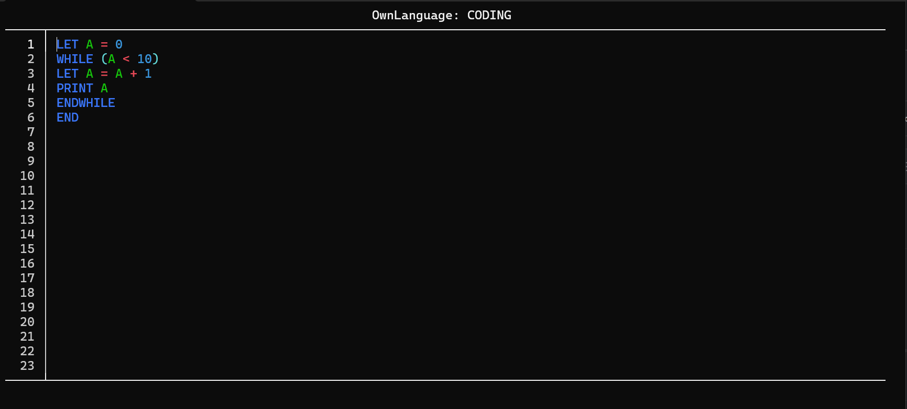

# OwnLanguage

A minimal BASIC-inspired programming language with a built-in terminal editor. Written entirely in C, runs in the Windows console.


---

## IN PROGRAMM SCREENSHOT



---

## Platform Support

| Platform      | Supported | Notes           |
|---------------|-----------|-----------------|
| Windows 11    | ✅        | Fully supported |
| macOS         | ❌        | Not supported   |
| Linux         | ❌        | Not supported   |

OwnLanguage uses the Windows Console API (`windows.h`) directly for cursor control, color output and raw keyboard input. There is no platform abstraction layer — it is Windows only by design. macOS and Linux builds will not compile.

---

## Releases

Grab the latest release at [github.com/MrLuki2727/OwnLanguage/releases](https://github.com/MrLuki2727/OwnLanguage/releases). Download, run `OwnLanguage.exe`, done.

---

## Editor

The editor opens directly in the terminal. Line numbers are shown automatically on the left - you don't type them.

| Key           | Action                           |
|---------------|----------------------------------|
| Arrow keys    | Move cursor                      |
| Any character | Insert at cursor position        |
| Backspace     | Delete character left of cursor  |
| Delete        | Delete character right of cursor |
| Tab           | Run the program                  |
| F1            | Enter debug mode                 |
| ESC           | Open menu                        |

The editor only redraws the line that actually changed - not the entire screen. Syntax highlighting is built in.

---

## Debug Mode

Press **F1** to enter debug mode. The interpreter steps through the program one line at a time - press any key to advance to the next line.

While stepping, all variables that have been assigned a value are shown on the right side of the screen with their current values. The currently executing line is highlighted.

- Lines that cause an error are highlighted in **red**
- The final `END` line is highlighted in **green**

Press any key to return to the editor after the program finishes or hits an error.

---

## Language Reference

Variables are single uppercase letters `A` to `Z`. There are no types — everything is a number (`int`).

### Commands

**LET** - assign a value to a variable
```
LET A = 5
LET A = A + 1
LET B = A * 2
```
One operation per assignment. No chained expressions.

**PRINT** - print a value to the output
```
PRINT A
PRINT 42
PRINT A + 3
```

**INPUT** - read a number from the user into a variable
```
INPUT A
```

**IF** - conditional execution, runs any command if condition is true
```
IF (A < 10) PRINT A
IF (A == 3) LET B = 0
IF (A > 5) GOTO 8
```

**ELSE** - must be on the line directly after an IF
```
IF (A < 5) PRINT A
ELSE PRINT 99
```

**WHILE / ENDWHILE** - loop while condition is true
```
WHILE (A < 10)
LET A = A + 1
PRINT A
ENDWHILE
```
Supports multiple whiles.

**GOTO** - jump to a line number
```
GOTO 3
```

**REM** - comment, line is ignored by the interpreter
```
REM this is a comment
```

**END** - stop execution
```
END
```

### Operators

| Type       | Symbols                      |
|------------|------------------------------|
| Arithmetic | `+` `-` `*` `/`              |
| Comparison | `==` `!=` `<` `>` `<=` `>=` |

### Example Program

```
LET A = 0
WHILE (A < 10)
LET A = A + 1
PRINT A
ENDWHILE
PRINT 99
END
```

Output: `1 2 3 4 5 6 7 8 9 10 99`

---

## File Format

Programs are saved as `.lu` files. Plain text, one command per line, no line numbers in the file (the editor handles those).

On startup, OwnLanguage reads `config.txt` (auto-generated) to find the last opened file and opens it automatically. If `config.txt` doesn't exist yet, it gets created on the first save.

---

## Project Structure

```
main.c          - entry point, keyboard loop
editor.c/.h     - terminal editor, drawing, input handling
programm.c/.h   - program storage (array of lines)
run.c/.h        - interpreter, execution loop
logik.c/.h      - expression parser, condition evaluator
variablen.c/.h  - variable storage (A-Z)
console.c/.h    - low-level console functions (gotoxy, getxy, colors)
```

---

